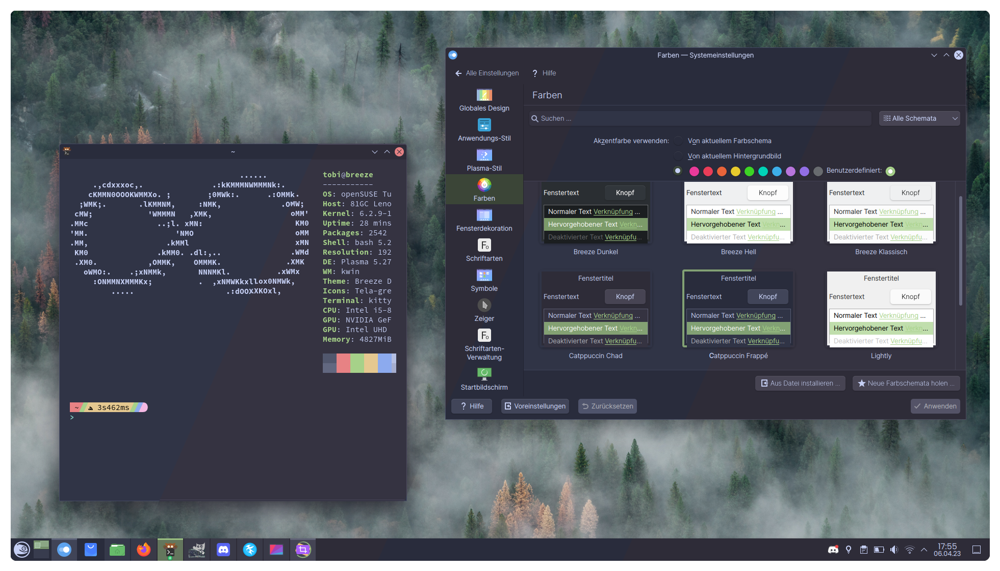

# Chadpuccin
### `t͡ʃˈæd pˈuːt͡ʃɪn`` - pronounced: Schaedpudjin

> A warmer, more wholesome (unofficial!) catppuccin flavor

## color palettes

 

 🌻 Latte 

| Labels | Hex |
|-----|------|
| Rosewater | `#dc8a78` |
| Flamingo | `#dd7878` |
| Pink | `#ea76cb` | 
| Mauve | `#8839ef` | 
| Red | `#d20f39` |
| Maroon | `#e64553` | 
| Peach | `#fe640b` | 
| Yellow | `#df8e1d` | 
| Green | `#40a02b` | 
| Teal | `#40a02b` | 
| Sky | `#04a5e5` | 
| Sapphire | `#209fb5` | 
| Blue | `#1e66f5` | 
| Lavender | `#7287fd` | 
| Text | `#4c4f69` |
| Subtext1 | `#5c5f77` |
| Subtext0 | `#6c6f85` |
| Overlay2 | `#827E8D` |
| Overlay1 | `#918E9C` |
| Overlay0 | `#A19FAB` |
| Surface2 | `#B1BOBA` |
| Surface1 | `#COBFC8` |
| Surface0 | `#CFCFD7` |
| Base | `#f0f1f4` |
| Mantle | `#E8E8ED` |
| Crust | `#dfdfe5` |

> Link for the normal [colors](https://coolors.co/dce0e8-e6e9ef-eff1f5-ccd0da-bcc0cc-acb0be-9ca0b0-8c8fa1-7c7f93)

> Link to the warmed up [colors](https://coolors.co/dfdfe5-e8e8ed-f0f1f4-cfcfd7-c0bfc8-b1b0ba-a19fab-918e9c-827e8d)

 

 🏋️‍♂️ Frappe 

| Labels | Hex |
|-----|------|
| Rosewater | `#f2d5cf` |
| Flamingo | `#eebebe` |
| Pink | `#f4b8e4` | 
| Mauve | `#ca9ee6` | 
| Red | `#e78284` |
| Maroon | `#ea999c` | 
| Peach | `#ef9f76` | 
| Yellow | `#e5c890` | 
| Green | `#a6d189` | 
| Teal | `#81c8be` | 
| Sky | `#99d1db` | 
| Sapphire | `#85c1dc` | 
| Blue | `#8caaee` | 
| Lavender | `#babbf1` | 
| Text | `#c6d0f5` |
| Subtext1 | `#b5bfe2` |
| Subtext0 | `#a5adce` |
| Overlay2 | `#9d9ab1` |
| Overlay1 | `#8b899e` |
| Overlay0 | `#7b788c` |
| Surface2 | `#696779` |
| Surface1 | `#585666` |
| Surface0 | `#474453` |
| Base | `#353341` |
| Mantle | `#2e2c38` |
| Crust | `#272530` |

> Link for the normal [colors](https://coolors.co/232634-292c3c-303446-414559-51576d-626880-737994-838ba7-949cbb)

> Link to the warmed up [colors](https://coolors.co/272530-2e2c38-353341-474453-585666-696779-7b788c-8b899e-9d9ab1)

 

 🌺 Macchiato 

| Labels | Hex |
|-----|------|
| Rosewater | `#f4dbd6` |
| Flamingo | `#f0c6c6` |
| Pink | `#f5bde6` | 
| Mauve | `#c6a0f6` | 
| Red | `#ed8796` |
| Maroon | `#ee99a0` | 
| Peach | `#f5a97f` | 
| Yellow | `#eed49f` | 
| Green | `#a6da95` | 
| Teal | `#8bd5ca` | 
| Sky | `#91d7e3` | 
| Sapphire | `#7dc4e4` | 
| Blue | `#8aadf4` | 
| Lavender | `#b7bdf8` | 
| Text | `#cad3f5` |
| Subtext1 | `#b8c0e0` |
| Subtext0 | `#a5adcb` |
| Overlay2 | `#9C98AE` |
| Overlay1 | `#88869A` |
| Overlay0 | `#757285` |
| Surface2 | `#625F71` |
| Surface1 | `#4F4C5E` |
| Surface0 | `#3C3949` |
| Base | `#2A2635` |
| Mantle | `#22202C` |
| Crust | `#1B1923` |

> Link for the normal [colors](https://coolors.co/181926-1e2030-24273a-363a4f-494d64-5b6078-6e738d-8087a2-939ab7)

> Link to the warmed up [colors](https://coolors.co/1b1923-22202c-2a2635-3c3949-4f4c5e-625f71-757285-88869a-9c98ae)

 

 🌿 Mocha 

| Labels | Hex |
|-----|------|
| Rosewater | `#f5e0dc` |
| Flamingo | `#f2cdcd` |
| Pink | `#f5c2e7` | 
| Mauve | `#cba6f7` | 
| Red | `#f38ba8` |
| Maroon | `#eba0ac` | 
| Peach | `#fab387` | 
| Yellow | `#f9e2af` | 
| Green | `#a6e3a1` | 
| Teal | `#94e2d5` | 
| Sky | `#89dceb` | 
| Sapphire | `#74c7ec` | 
| Blue | `#89b4fa` | 
| Lavender | `#b4befe` | 
| Text | `#cdd6f4` |
| Subtext1 | `#bac2de` |
| Subtext0 | `#a6adc8` |
| Overlay2 | `#9b98ab` |
| Overlay1 | `#868395` |
| Overlay0 | `#726f80` |
| Surface2 | `#5e5b6a` |
| Surface1 | `#4a4755` |
| Surface0 | `#363240` |
| Base | `#221e2a` |
| Mantle | `#1b1822` |
| Crust | `#141119` |

> Link for the normal [colors](https://coolors.co/11111b-181825-1e1e2e-313244-45475a-585b70-6c7086-7f849c-9399b2)

> Link to the warmed up [colors](https://coolors.co/141119-1b1822-221e2a-363240-4a4755-5e5b6a-726f80-868395-9b98ab)

 

## Example images

 Github 

 

## How this came to be
When Fall arrived, I was tired of the cold and blue tone of catppucciny, yet I loved the pastell colors.
So I came up with the idea of just creating a warmer and more welcoming port. I just warmed up the background colors and kept the pastell accents.

## Why is it called chadpuccin
It's called that way, because people using chadpuccin can only be chads. So go workout, explore nature, make memories and be a chad.